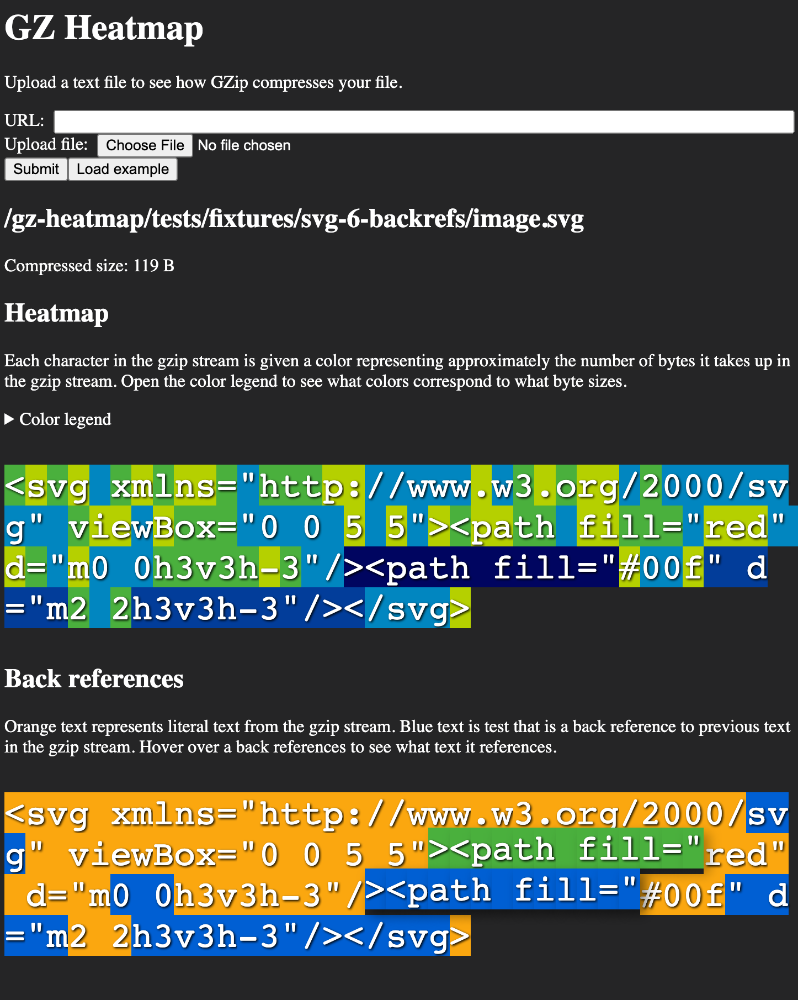

# gz-heatmap

Produce a heatmap of gzip files to better understand how gzip compresses your code.

## Usage

### Website

Go to https://andrewiggins.github.io/gz-heatmap/ and enter a URL or upload a file to see how GZip compresses your file. Your file is compressed using the [`pako` library](https://github.com/nodeca/pako) with `memLevel` set to `9` (highest compression).

### CLI

Install this npm package to run `gz-heatmap` on a file. It'll compress the given text file using NodeJS's bundled `zlib` and output a local HTML file to view how gzip compresses your file.

### NPM package

If you'd like to build your UI, you can `import { gzinflate } from "gz-heatmap";` to inflate a gzip file and get back metadata describing how gzip has compressed your file.

## Acknowledgements

- [gzthermal](https://encode.su/threads/1889-gzthermal-pseudo-thermal-view-of-Gzip-Deflate-compression-efficiency)
  This repository is basically a JS implementation of wicked-cool gzthermal tool. I wanted to add some nifty interactive features gzthermal so I re-implemented it in JavaScript to add them.
- [gzthermal-web](https://github.com/simonw/gzthermal-web)
  How I originally discovered the gzthermal tool.
- [tiny-inflate](https://github.com/foliojs/tiny-inflate)
  The core inflate algorithm is based on [a fork](https://github.com/andrewiggins/tiny-inflate/tree/experiments) of the tiny-inflate JS implementation.
- [fflate](https://github.com/101arrowz/fflate/)
  Another JS inflate implementation I looked at to understand how GZip works
